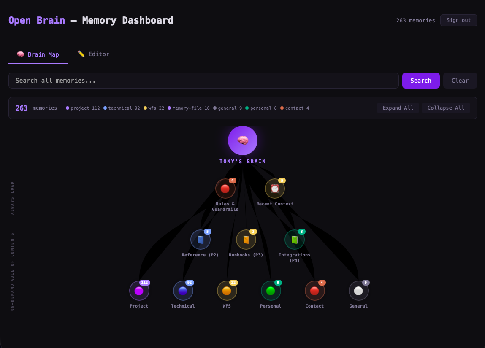
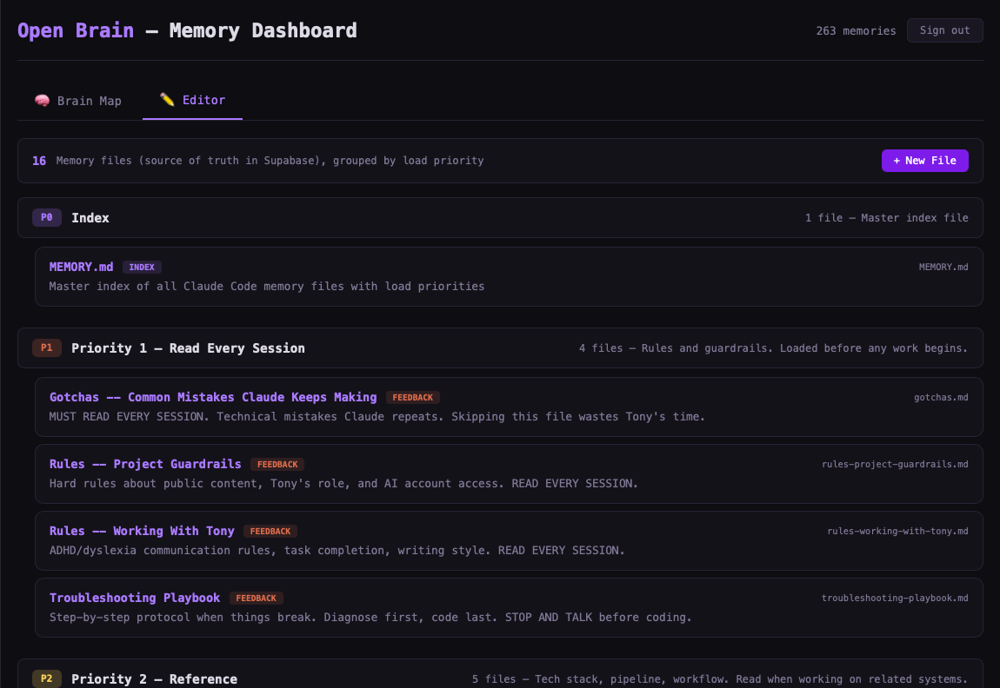

# Open Brain

**Stop your AI from forgetting your rules.**

Open Brain is a visual dashboard for managing what your AI knows, when it loads it, and how it prioritizes context. Built for people who work with AI agents every day and need persistent, structured memory that works across tools.

Works with Claude Code, Claude Desktop, ChatGPT, Cursor, or any MCP-compatible AI tool. Pairs with [Mem0](https://mem0.ai) for intelligent memory compression and deduplication.

   

## The Problem

AI agents start every session with amnesia. You re-explain your preferences, re-state your rules, re-describe your project. Notes apps and docs don't solve this because they're flat -- the AI doesn't know what to read first, what's critical vs. reference, or when to load what.

## How Open Brain Solves It

**Priority-based loading.** Not all memories are equal. P1 rules load every session. P2 reference loads when relevant. P3 runbooks load before touching specific systems. P4 integrations load only when needed. Your AI boots up like an operating system, not a blank slate.

**Visual brain map.** See your entire memory hierarchy at a glance. Click any node to expand, edit, or delete. Know exactly what your AI knows.

**Semantic search.** Find any memory by meaning, not keywords. Powered by pgvector embeddings.

**Works across tools.** One memory bank, any AI tool. Claude Code at work, ChatGPT on your phone, Cursor in your IDE -- they all read from the same brain.

## Screenshots

### Brain Map -- Visual Memory Hierarchy


### Editor -- Priority-Based Memory Files


## Who This Is For

- **AI power users** who work with Claude/GPT daily and are tired of re-explaining context
- **Developers** building with AI agents who need persistent project memory
- **Teams** that want shared AI context (rules, preferences, guardrails) across members
- **Anyone** who's said "I already told you this last session"

## Why Not Just Use Notes?

| | Notes/Docs | Open Brain |
|---|---|---|
| Priority loading | No | P1-P4 system |
| Semantic search | No | pgvector embeddings |
| Agent-readable | Copy-paste | MCP protocol (native) |
| Session boot sequence | Manual | Automatic checklist |
| Mid-session refresh | Start over | `/refresh` command |
| Multi-tool | Per-app | One brain, any tool |

## Key Concepts

### Priority-Based Load Order
```
P1 (Always Load)    -- Rules, guardrails, gotchas. Every session, no exceptions.
P2 (Reference)      -- Tech stack, pipeline, workflow. When working on related systems.
P3 (Runbooks)        -- How-to guides, specs, roadmap. Before touching these systems.
P4 (Integrations)   -- Third-party setup docs. Only when relevant.
```

### Session Start Checklist
Your AI agent follows this boot sequence every session:
1. Load P1 rules (non-negotiable)
2. Load recent context (last session checkpoint)
3. Read table of contents (know what exists, don't load everything)
4. Ask what you're working on
5. Load specific memories on-demand as topics come up

### The /refresh Pattern
Long AI sessions cause context drift -- the agent "forgets" rules loaded at the start. The `/refresh` command forces re-reading of P1 rules mid-session without starting over.

### Mem0 Integration (Optional)
[Mem0](https://mem0.ai) adds an intelligent layer on top of Open Brain:
- **Automatic deduplication** -- won't store the same fact twice
- **Memory compression** -- extracts clean facts from messy conversations
- **Better relevance ranking** -- 0.9 similarity scores vs. 0.5 with raw pgvector
- Supabase stays your source of truth. Mem0 makes search smarter.

## Quick Start

1. Create a [Supabase](https://supabase.com) project
2. Clone this repo
3. Replace `YOUR_SUPABASE_URL` and `YOUR_SUPABASE_ANON_KEY` in `index.html`
4. Add your email to `ALLOWED_EMAILS`
5. Deploy to [Vercel](https://vercel.com)

Full setup instructions in [CLAUDE.md](CLAUDE.md) (readable by both humans and AI agents).

## Stack
- **Frontend:** Vanilla HTML/CSS/JS (no build step, single file)
- **Auth:** Supabase Auth with Google OAuth
- **Database:** Supabase (Postgres + pgvector)
- **Hosting:** Vercel
- **Memory Protocol:** MCP (Model Context Protocol)
- **Smart Layer (optional):** Mem0 for compression, dedup, and ranking

## How Your AI Agent Uses This

```
Session starts
  |
  v
Load P1 rules (ADHD rules, project guardrails, gotchas)
  |
  v
Load recent memories (last session checkpoint)
  |
  v
Read table of contents (know what exists)
  |
  v
Ask: "What are we doing today?"
  |
  v
Load specific memories on-demand as topics come up
  |
  v
After meaningful work, save a checkpoint
```

## Architecture

```
You <-> AI Agent (Claude/GPT/Cursor)
            |
            v
        MCP Server (personal-memory)
            |
            v
        Mem0 (smart layer - optional)
            |
            v
        Supabase (source of truth)
            |
            v
        Open Brain Dashboard (visual UI)
```

## Contributing
PRs welcome. If you build something cool on top of this, open a PR or issue.

## License
MIT
